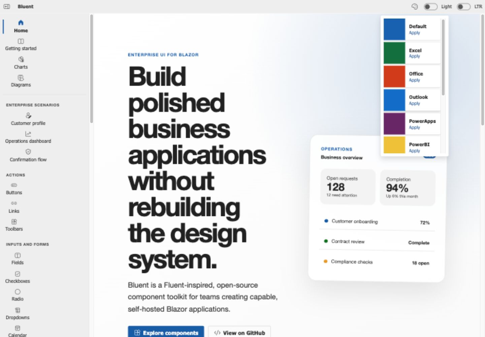
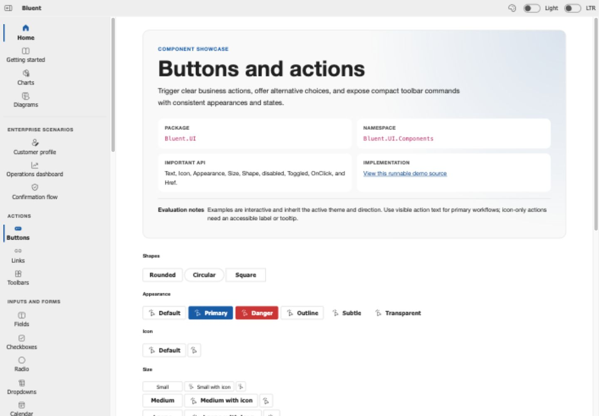
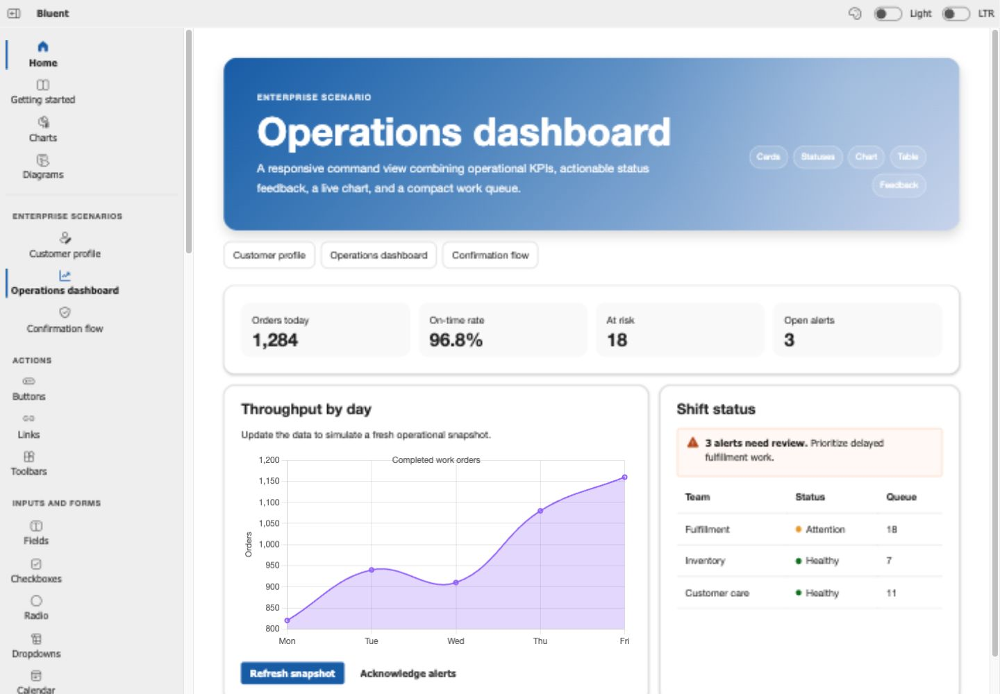
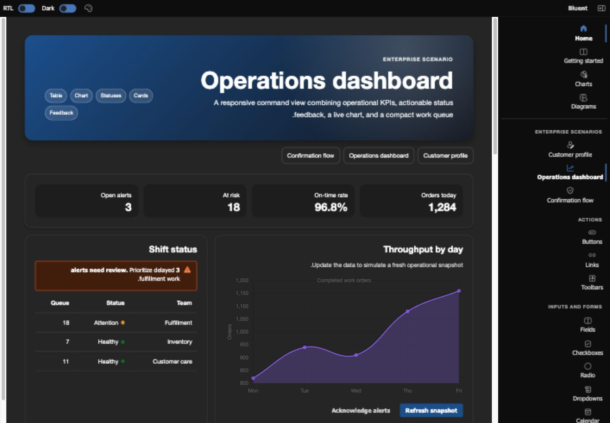

# Bluent demo gallery

These screenshots were captured from the running Blazor WebAssembly demo after desktop, mobile, theme, direction, navigation, interaction, and console validation. They represent the current Sprint 2 implementation rather than design mockups.

## Product landing

Light theme, left-to-right direction, 1440 × 1000 CSS-pixel viewport.

## Component showcase

The shared showcase header gives high-value pages consistent purpose, package, namespace, API, source, and evaluation context.

## Enterprise scenario

The operations dashboard combines KPI cards, status feedback, an interactive chart, a responsive work queue, and actions.

## Dark theme and RTL

The same dashboard in the dark theme and right-to-left direction. Layout order, navigation, content alignment, chart sizing, and horizontal overflow were checked after the mode change.

## Capture environment

- Demo: `src/Bluent.UI.Demo`
- Host: local Kestrel development host
- Browser: Codex in-app Chromium browser
- Operating system: macOS
- Viewport: 1440 × 1000 CSS pixels
- Capture date: 2026-07-25

The exact commit SHA, build/test/pack results, deployment workflow run, and deployed URL are recorded in the Sprint 2 completion pull request.
