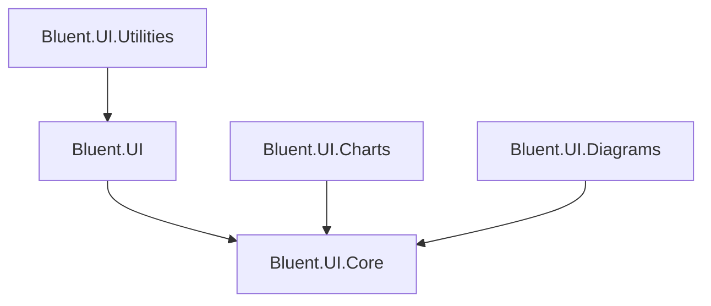

# Bluent packages

Use the smallest set of packages that provides the required component areas. All current packages target .NET 10 and browser-capable Blazor applications.

## Package map

| Package | Role | Direct Bluent dependency | Typical consumer |
| --- | --- | --- | --- |
| `Bluent.UI` | Main UI components and overlay services | `Bluent.UI.Core` | Most Bluent applications |
| `Bluent.UI.Charts` | Chart components powered by Chart.js | `Bluent.UI.Core` | Applications that need charts |
| `Bluent.UI.Diagrams` | Interactive diagramming components and tools | `Bluent.UI.Core` | Applications that need diagrams |
| `Bluent.UI.Utilities` | Higher-level application patterns such as MDI and busy state | `Bluent.UI` | Desktop-style or utility-heavy applications |
| `Bluent.UI.Core` | Shared abstractions and base functionality | None | Package infrastructure; normally indirect |

These relationships are taken from the current project references. NuGet resolves direct dependencies automatically.

## Selection guidance

### Start with `Bluent.UI`

Install `Bluent.UI` for the standard component library:

```bash
dotnet add package Bluent.UI
```

This is the primary package and the default starting point. Follow the [Getting Started guide](../getting-started/index.md) for registration, styles, containers, and a minimal component.

### Add Charts independently when needed

```bash
dotnet add package Bluent.UI.Charts
```

Import:

```razor
@using Bluent.UI.Charts.Components
```

The Charts project references `Bluent.UI.Core`, not `Bluent.UI`. Do not infer that installing Charts also installs the main UI component library.

The package includes its chart JavaScript asset. A fully verified chart-specific setup and example remain part of the component documentation work.

### Add Diagrams independently when needed

```bash
dotnet add package Bluent.UI.Diagrams
```

Import:

```razor
@using Bluent.UI.Diagrams.Components
```

Add the diagram stylesheet:

```html
<link href="_content/Bluent.UI.Diagrams/bluent.ui.diagrams.min.css" rel="stylesheet" />
```

The Diagrams project references `Bluent.UI.Core`, not `Bluent.UI`. Install the main package separately when the application also uses its components or services.

### Add Utilities on top of the main UI package

```bash
dotnet add package Bluent.UI.Utilities
```

Import and register:

```razor
@using Bluent.UI.Utilities
@using Bluent.UI.Utilities.Extensions
```

```csharp
builder.Services.AddBluentUI();
builder.Services.AddBluentUtilities();
```

Utilities directly depends on `Bluent.UI`. Its registration currently adds scoped MDI and busy-indicator services by default.

### Do not normally install Core directly

`Bluent.UI.Core` exists to share abstractions and base behavior between Bluent packages. Application developers should normally install the feature package they need and allow NuGet to resolve Core transitively.

Install Core directly only when deliberately building an integration against its public abstractions and after verifying that those APIs are intended for the use case.

## Boundaries

- Standard controls, theme services, dialogs, drawers, popovers, toasts, tooltips, docking, and DOM helpers belong to `Bluent.UI`.
- Charts belong to `Bluent.UI.Charts`.
- Diagramming belongs to `Bluent.UI.Diagrams`.
- MDI and busy-indicator application utilities belong to `Bluent.UI.Utilities`.
- Shared base functionality belongs to `Bluent.UI.Core` and should not be treated as the main end-user package.
- Installing one specialized package does not import another package's Razor namespace.
- Static assets are served under `_content/{PackageId}/...`; package-specific guides must list any required stylesheet or script behavior.

## Current dependency shape



## Version alignment

Until a formal compatibility matrix is published:

- Prefer the same released version across all directly installed Bluent packages.
- Review the changelog and release notes before upgrading.
- Do not assume packages from different release lines are compatible.
- Treat the target framework and dependency versions in the released NuGet package as authoritative.

## Verification sources

This guide was checked on 2026-07-25 against:

- `src/Bluent.Core/Bluent.Core.csproj`
- `src/Bluent.UI/Bluent.UI.csproj`
- `src/Bluent.UI.Charts/Bluent.UI.Charts.csproj`
- `src/Bluent.UI.Diagrams/Bluent.UI.Diagrams.csproj`
- `src/Bluent.UI.Utilities/Bluent.UI.Utilities.csproj`
- `src/Bluent.UI/Extensions/ServiceCollectionExtensions.cs`
- `src/Bluent.UI.Utilities/Extensions/ServiceCollectionExtensions.cs`

Package build, pack, and consumer-project validation remain required before the documentation is release-validated.
